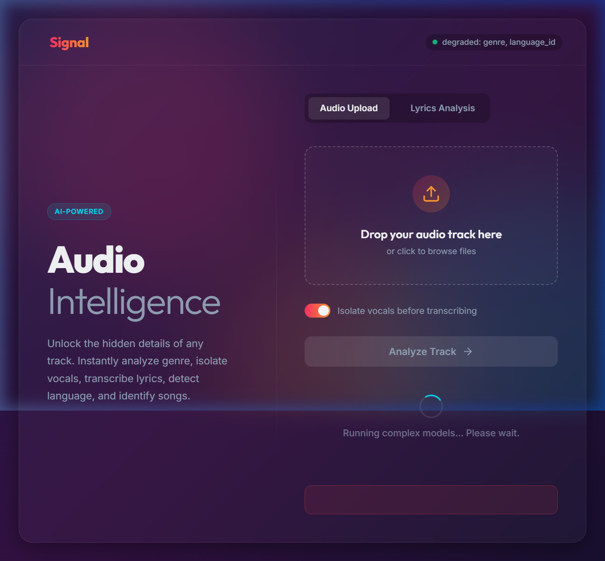

<div align="center">

# 🎶 Signal 
**Advanced Audio Intelligence Web App**

*Unlock the hidden details of any track. Instantly analyze genre, isolate vocals, transcribe lyrics, detect language, and identify songs.*

<br />

[](https://python.org)
[](https://flask.palletsprojects.com/)
[](https://pytorch.org/)
[](https://opensource.org/licenses/MIT)

---

### 📸 App Interface



</div>

---

## ✨ Features & Capabilities

| Feature | Description | Powered By |
| :--- | :--- | :--- |
| 🎸 **Genre Prediction** | Classifies tracks into 400 micro-genres | `Essentia Discogs-400` |
| ✂️ **Vocal Separation** | Extracts isolated vocals and instrumentals | `Demucs` |
| 📝 **Transcription** | Highly accurate vocal transcription | `OpenAI Whisper` |
| 🌍 **Language ID** | Detects spoken/sung language | `IndicLID + fastText` |
| 🔍 **Song Identification** | Matches audio & fetches lyrics | `AcoustID` & `Genius` |
| 🔗 **URL Support** | Download & analyze audio directly via links | `yt-dlp` |

---

## 🚀 Quick Start Guide

### 1️⃣ System Dependencies
You will need **Chromaprint** for AcoustID fingerprinting.
```bash
# Ubuntu/Debian
sudo apt-get install -y libchromaprint-tools

# macOS
brew install chromaprint
```

### 2️⃣ Python Environment
> **Note:** Python 3.10–3.11 is strictly recommended for Essentia/Torch compatibility.

```bash
python -m venv venv
source venv/bin/activate   # On Windows: venv\Scripts\activate
pip install -r requirements.txt
```

### 3️⃣ API Keys
Set up your environment variables safely:
```bash
cp .env.example .env
```
* **AcoustID**: Get your key [here](https://acoustid.org/new-application)
* **Genius**: Get your token [here](https://genius.com/api-clients)

### 4️⃣ Run the App
```bash
python app.py
```
> ⚡️ **First Run Note:** The initial run downloads the genre model files, Whisper weights, and IndicLID models (requires a few GBs). **Subsequent starts are lightning fast!**

---

## 🏗 Project Architecture

<details>
<summary><b>Click to view the directory structure</b></summary>

```text
music_flask_app/
├── app.py              # 🚀 Flask routes
├── models.py           # 🧠 The analysis pipeline (genre, Demucs, Whisper, etc.)
├── config.py           # ⚙️ Env-based settings
├── requirements.txt    # 📦 Dependencies
├── .env.example        # 🔑 Template for API keys
├── templates/          # 🖥️ HTML templates
├── static/             # 🎨 CSS and JS assets
├── uploads/            # 📁 Temp storage for incoming files (auto-created)
├── separated/          # ✂️ Demucs output cache (auto-created)
└── model_files/        # 📥 Downloaded model weights (cached)
```
</details>

---

## ⚡ What changed vs. the original notebook?

* 🔄 **Models load once** at app startup, instead of once per notebook cell run.
* 🔐 **API keys are secure** via environment variables (`.env`).
* 🛡 **Resilient Pipeline:** If one model fails to download (e.g., the genre model), the app still boots, and that specific route returns a clear error instead of crashing the server.
* 🧹 **Auto-Cleanup:** Uploaded files are deleted post-request to manage disk usage.

---

## ⏱️ Timing Expectations

> 💡 **Pro Tip:** Vocal separation adds real processing time. On a CPU, running Demucs before Whisper is noticeably slower than on a GPU. Uncheck *"Isolate vocals before transcribing"* in the UI to skip straight to transcribing the full mix if speed is your priority!

---

## 🛠️ Production Notes

<details>
<summary><b>Planning to deploy? Read this first</b></summary>

This is a **working, synchronous** app — perfect for local use, demos, or low-traffic internal tools. If deploying to production traffic:

1. **Job Queue (Celery/RQ + Redis)**: Audio requests take 30s–several minutes. A synchronous Flask request will timeout. Swap the audio route to enqueue a job. `models.analyze_audio_upload()` is already a standalone function and drops into a worker task perfectly.
2. **Production WSGI**: Use `gunicorn` or `uwsgi` instead of Flask's dev server.
3. **Cache Management**: The `separated/` folder grows unbounded. Implement a cron job to clear it.
4. **Rate Limiting**: Protect your endpoints; each request is compute-heavy.

</details>

<details>
<summary><b>📜 Licensing Reminder</b></summary>

* **Non-Commercial**: Genre model and AcoustID. Check Genius's API terms before commercial use.
* **MIT License**: Demucs and Whisper have no such restriction.
</details>

<br/>
<div align="center">
  <sub>Built with ❤️ using Python, Flask, and AI</sub>
</div>
